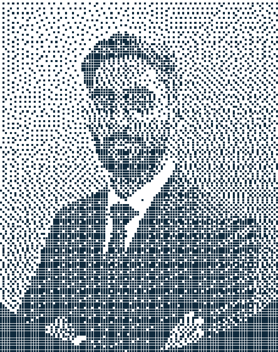

 

<table>
<tr>

<td align="center">

</td>

<td width="15"></td>

<td align="center">

</td>

<td width="15"></td>

<td align="center">

</td>

</tr>
</table>

 

---

# 👋 Hi, I'm Jivesh Sharma

### MERN Stack Developer • Backend Enthusiast • AI Explorer

I'm a **Computer Science Engineering student** passionate about building modern, scalable web applications with the **MERN Stack**.

I enjoy designing backend architectures, developing secure REST APIs, and creating applications that solve real-world problems. My long-term vision is to combine **Artificial Intelligence** with full-stack development to build intelligent, production-ready software.

> 🚀 **Currently:** Mastering MERN Stack Development
> 🤖 **Next Goal:** Building AI-powered web applications using modern AI tools and LLMs.

---

## 🚀 About Me

<table>
<tr>
<td width="220" valign="top">
<picture>
  <source media="(prefers-color-scheme: dark)" srcset="assets/dark.svg">
  <source media="(prefers-color-scheme: light)" srcset="assets/light.svg">
  
</picture>
</td>
<td valign="top">

- 🎓 B.Tech Computer Science Engineering Student
- 💻 Building modern full-stack applications using the MERN Stack
- ⚙️ Passionate about backend development and scalable architectures
- 🌱 Currently learning Authentication, API Security, System Design and Database Optimization
- 🤖 Exploring AI integration for future web applications
- 🎯 Goal: Become a Full-Stack & AI Engineer building impactful software

</td>
</tr>
</table>

---

## ⚙️ Tech Stack & Tools

### 💻 Frontend

  

### ⚙️ Backend

  

### 🗄️ Database

  

### 💻 Programming Languages

  

### 🛠️ Tools & Platforms

---

## 🔥 Current Focus

- 🚀 Building production-ready **MERN Stack** applications
- ⚡ Designing secure and scalable REST APIs
- 🔐 Learning Authentication & Authorization (JWT, RBAC)
- 🧠 Strengthening Data Structures & Algorithms
- 📚 Exploring System Design and Backend Best Practices
- 🤖 Preparing to integrate AI into modern web applications

---

## 🚀 Featured Projects

### 🧭 HireFlow

A modern **MERN Stack** application for tracking job applications, interviews, and hiring progress with a clean and intuitive interface.

#### ✨ Features
- Job Application Tracking
- Interview Management
- Status Dashboard
- Responsive UI
- REST API Architecture

#### 🛠️ Built With
`React` • `Node.js` • `Express.js` • `MongoDB`

🔗 **Live Demo**
<https://hire-flow-one-weld.vercel.app/>

🔗 **Repository**
<https://github.com/Jivesh21/HireFlow>

---

### 🌐 Portfolio Website

My personal developer portfolio showcasing my projects, technical skills, certifications, and learning journey.

#### ✨ Features
- Responsive Design
- Modern UI
- Project Showcase
- Contact Section
- Interactive Animations

#### 🛠️ Built With
`React` • `JavaScript` • `CSS`

🔗 **Live Website**
<https://portfolio.jiveshsharma2220.workers.dev/>

🔗 **Repository**
<https://github.com/Jivesh21/Portfolio>

---

### 🚲 Bike Sharing Rental Prediction

A Machine Learning project that predicts bike rental demand using historical and environmental datasets.

#### ✨ Features
- Data Cleaning
- Feature Engineering
- Model Training
- Data Visualization
- Prediction Analysis

#### 🛠️ Built With
`Python` • `Pandas` • `NumPy` • `Scikit-learn`

🔗 **Repository**
<https://github.com/Jivesh21/bike-sharing-rental-prediction>

---

## 📚 Currently Learning

| 🌱 Learning | 🚀 Next Step |
|-------------|--------------|
| MERN Stack Development | Docker & Containerization |
| Authentication (JWT & OAuth) | AWS Cloud Basics |
| REST API Design | Microservices Architecture |
| Role-Based Access Control (RBAC) | CI/CD Pipelines |
| MongoDB Aggregation Pipeline | Kubernetes |
| Backend Security | AI Integration with Web Applications |
| System Design Fundamentals | LLM Applications & AI Agents |

---

## 🎯 current goals

- 🚀 Build **5+ production-ready MERN Stack projects**
- 💼 Secure a **Software Development Internship**
- ☁️ Learn **Docker**, **AWS**, and deployment workflows
- 🧠 Master **Backend Development** and **System Design**
- 📖 Solve **300+ DSA problems**
- 🤖 Build intelligent AI-powered web applications
- 🌍 Contribute consistently to Open Source
- 📈 Maintain an active GitHub profile

---

## 📊 GitHub Analytics

  

> ⚠️ Replace `YOUR-VERCEL-URL` with your self-hosted `github-readme-stats` deployment from Phase 3. Note the `theme=` params were removed in favor of explicit `bg_color`/`title_color`/etc. hex values — this locks the cards to your exact navy/cyan/emerald palette instead of a generic preset theme.

---

## 🏆 GitHub Trophies

---

## 📈 Contribution Activity

---

## 🐍 Contribution Snake

<picture>
  <source media="(prefers-color-scheme: dark)" srcset="https://raw.githubusercontent.com/Jivesh21/Jivesh21/output/snake-dark.svg" />
  <source media="(prefers-color-scheme: light)" srcset="https://raw.githubusercontent.com/Jivesh21/Jivesh21/output/snake-light.svg" />
  
</picture>

---

## 🏅 Certifications

| Certification | Platform |
|---------------|----------|
| 🎓 React JS | Unstop |
| 💻 JavaScript Essentials | Cisco Networking Academy |
| 🌐 Web Development | Internshala |
| 📊 Data Science Simulation | Deloitte Forage |

---

## 🌟 Beyond Coding

- 💡 I enjoy building projects that solve real-world problems.
- 📖 Always learning new technologies and backend concepts.
- 🤝 Love collaborating with developers and contributing to open-source projects.
- 🚀 Passionate about creating scalable web applications.
- 🤖 Excited about the future of AI-powered software.

---

## 📫 Let's Connect

&nbsp;

&nbsp;

<!--
  Note: the original brief specified "No GitHub badge" for this row, since your
  GitHub profile itself IS this page — a badge linking back to itself is redundant.
  Removed the GitHub badge that had crept back in here.
-->

---

## 💬 Favorite Quote

> **"First, solve the problem. Then, write the code."**
> — John Johnson

---

## ⚡ Fun Fact

💻 I enjoy building backend systems today, and my long-term goal is to create intelligent AI-powered applications that solve meaningful real-world problems.

---

## 📊 Profile Views

---

## 🤝 Let's Build Something Amazing

I'm always interested in collaborating on exciting projects involving:

🚀 Full-Stack Web Development • ⚙️ Backend Engineering • 🤖 AI-Powered Applications • 🌐 Open Source

If you have an interesting idea or opportunity, feel free to reach out!

---

## 💭 Developer Philosophy

> **"Great software isn't just about writing code—it's about solving real problems, continuously learning, and building solutions that make an impact."**

---

## 💡 Building today with MERN. Creating tomorrow with AI.

 

### ⭐ Thanks for visiting my profile!

If you like my work, consider giving a ⭐ to my repositories.

